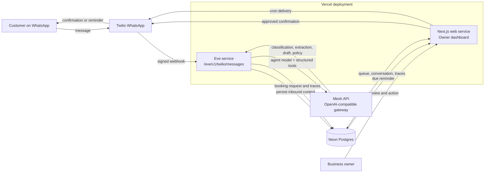
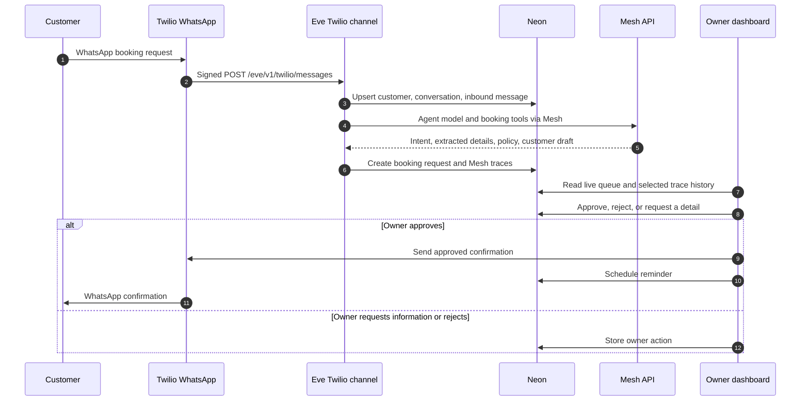
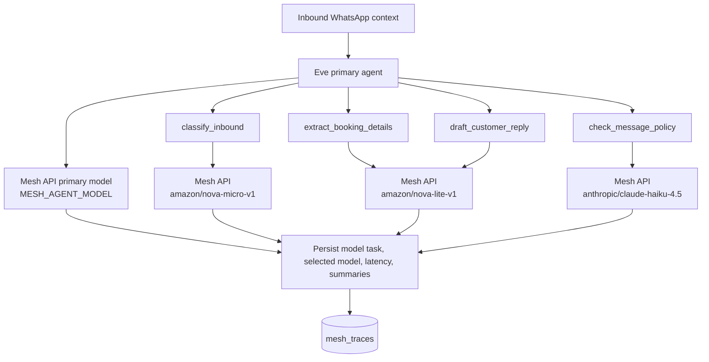
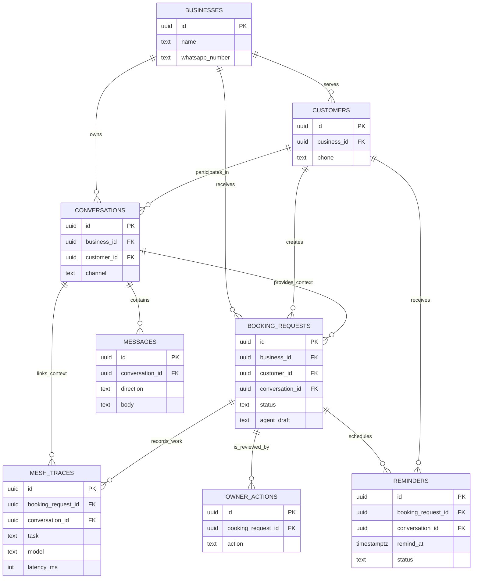
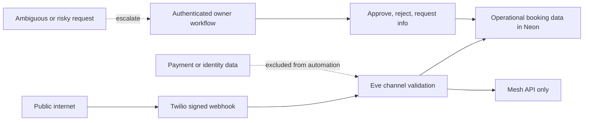

# SlotWaala Architecture

SlotWaala has two public surfaces: the Next.js owner dashboard and Eve's built-in Twilio webhook. They share Neon state. Mesh API is the only AI gateway for both the Eve primary model and the structured booking tools.

## Service Topology

Vercel routes `/eve/v1/*` to the Eve service. The remaining routes go to the Next.js web service.

## Inbound Booking Sequence

## AI Routing

The default model names are configuration defaults, not direct provider integrations. Environment variables can override them while retaining the Mesh API base URL and key.

## Data Model

## Trust Boundaries

The dashboard gives the owner the final say on customer-facing confirmations. SlotWaala treats operational booking details as the automation boundary and leaves payments outside it.
