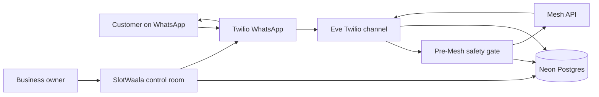

# SlotWaala

## WhatsApp bookings, with a human in the loop

SlotWaala is the front desk for service businesses that already run on WhatsApp.

A customer sends a natural message such as:

> “AC service chahiye tomorrow 4 PM, Koramangala. Please book.”

SlotWaala turns that message into a structured booking request, checks the owner’s real service hours, holds an available slot, drafts a reply, and puts the decision in front of the owner.

The customer only receives a confirmation after the owner approves it.

That is the product: **less back-and-forth for the owner, no invented availability, and no sensitive payment data sent to an AI model.**

## The five-minute front desk

### 1. Customer messages WhatsApp

The inbound channel is Twilio WhatsApp. Eve receives the webhook, validates the channel, identifies the business and customer, and stores the conversation in Neon.

### 2. SlotWaala understands the request

The Eve agent routes every AI call through Mesh API:

- classify the message and language
- check policy and risk
- extract service, area, timing, and missing details
- check the owner’s configured availability
- draft a short WhatsApp reply

The model never gets payment or identity secrets. A deterministic pre-model gate blocks payment, UPI, bank, card, Aadhaar, and PAN content first.

### 3. The owner sees a real decision

The dashboard is a small control room, not a generic chatbot screen:

- booking queue with missing-detail and approval states
- selected customer conversation
- editable agent draft
- Mesh trace showing task, model, latency, and summary
- configured service hours
- owner escalations with redacted context
- released-slot recovery offers
- reminder workload

### 4. The owner approves

The owner can edit the draft, ask for one more detail, reject the request, or approve it.

Approval is the boundary. SlotWaala then:

- confirms the real slot hold
- sends the approved WhatsApp message through Twilio
- records the outbound message
- schedules the reminder

### 5. A cancellation does not waste the slot

When a confirmed booking is cancelled, SlotWaala releases the hold and ranks compatible waitlist customers. Daypart preferences such as morning, afternoon, or evening are used when matching the released slot. The owner still approves the recovery offer before it is sent.

## Why this is not a payment agent

SlotWaala intentionally stops at operational scheduling.

It does not read payment screenshots, UPI IDs, card numbers, bank details, Aadhaar, or PAN data. If sensitive content is detected, the message is redacted and routed to an owner escalation. The raw sensitive text is not sent through Mesh or stored in the normal booking workflow.

## Product architecture



| Surface | Technology | Role |
| --- | --- | --- |
| Customer channel | Twilio WhatsApp | Inbound messages and approved outbound replies |
| Agent runtime | Eve.dev | Webhook channel, session context, agent tools |
| AI gateway | Mesh API | Every model call and visible model routing |
| Owner surface | Next.js | Queue, conversation review, approval, recovery |
| Persistent state | Neon Postgres | Customers, messages, slots, traces, reminders |
| Deployment | Vercel | Next.js web service and Eve service |

See [ARCHITECTURE.md](./ARCHITECTURE.md) for service topology, sequence diagrams, data model, and trust boundaries.

## Mesh routing

The default routing is cost-aware and visible in the dashboard trace:

| Job | Default model through Mesh |
| --- | --- |
| Agent primary model | `openai/gpt-4o-mini` |
| `classify_inbound` | `amazon/nova-micro-v1` |
| `extract_booking_details` | `amazon/nova-lite-v1` |
| `draft_customer_reply` | `amazon/nova-lite-v1` |
| `check_message_policy` | `anthropic/claude-haiku-4.5` |

All model IDs are sent to Mesh through its OpenAI-compatible endpoint. There is no direct provider key in SlotWaala.

## Run the product locally

Requirements: Node 24, a Neon Postgres database, a Mesh key, and Twilio credentials.

```bash
nvm use 24
npm install
cp .env.example .env.local
```

Apply [neon/schema.sql](./neon/schema.sql) to Neon, fill the environment values, then run the owner surface:

```bash
npm run dev
```

Run the Eve agent locally in a second terminal:

```bash
npm run agent:dev
```

Open `http://localhost:3000`, enter the owner access token, create the booking desk, and add at least one service-hours window before testing a booking.

## Production setup

1. Deploy the repo to Vercel.
2. Add the values from `.env.example` to the production environment.
3. Set `NEXT_PUBLIC_APP_URL` to the public Vercel origin.
4. Set `TWILIO_WHATSAPP_WEBHOOK_URL` to:
   `https://your-domain.vercel.app/eve/v1/twilio/messages`
5. Configure the same URL in the Twilio WhatsApp sender or Sandbox.
6. Create the business and service hours in the dashboard.
7. Send a real WhatsApp booking request and verify it appears in the queue.

The production dashboard supports two access levels:

- `DASHBOARD_ACCESS_TOKEN` gives the owner full control.
- `DEMO_ACCESS_TOKEN` gives judges a read-only live product tour.

Keep both tokens private. The demo token cannot approve bookings, send WhatsApp messages, change service hours, resolve escalations, or send recovery offers.

## Real verification

Static checks:

```bash
npm run typecheck
npm run build
npm run eval:preflight
```

The real webhook evaluation requires:

- `DATABASE_URL`
- `TWILIO_MESSAGING_FROM`
- `SLOTWAALA_E2E_WEBHOOK_URL`
- `SLOTWAALA_E2E_CUSTOMER_WHATSAPP`

Run it with:

```bash
npm run eval:e2e:real
```

The evaluation posts a Twilio-shaped inbound message to the configured Eve webhook and waits for the real booking request and Mesh traces. It does not bypass the agent by inserting a fake booking. Owner approval remains an explicit dashboard action.

## Repository map

| Path | What lives there |
| --- | --- |
| `agent/` | Eve agent, Twilio channel, session context, and Mesh-backed tools |
| `app/` | Next.js owner dashboard, server actions, login, and reminder route |
| `lib/` | Neon persistence, availability, recovery, reminders, and Twilio delivery |
| `neon/schema.sql` | Booking, message, slot, trace, owner-action, and reminder tables |
| `scripts/` | Preflight and real webhook evaluation |
| `ARCHITECTURE.md` | Mermaid diagrams and trust boundaries |
